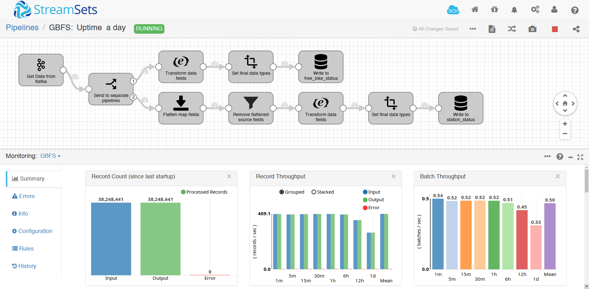

# A Python and StreamSets dataflow for the General Bikeshare Feed Specification (GBFS)

This repository has three parts: Python code to access each `station_station` and `free_bike_status` endpoint provided by [GBFS](https://github.com/NABSA/gbfs), a StreamSets dataflow to insert the data into an OmniSci database and the OmniSci table definition DDLs.

## Python

There are 4 [Python scripts](https://github.com/omnisci/gbfs_kafka/tree/master/src) in this repository:

* `build_gbfs_endpoints.py` - reads GBFS endpoints from the GBFS [system.csv](https://github.com/NABSA/gbfs/blob/master/systems.csv) file, then accesses each working endpoint
* `build_slow_changing_tables.py` - creates CSVs of endpoints that change slow enough that they don't need to be built every minute
* `free_bike_status.py` - accesses each endpoint from the working free bike status endpoints identified by `build_gbfs_endpoints.py`, writing the results to Apache Kafka
* `station_status.py` - accesses each endpoint from the working free bike status endpoints identified by `build_gbfs_endpoints.py`, writing the results to Apache Kafka

The two main scripts are `free_bike_status.py` and `station_status.py`, which are intended to be run once per minute (in our case, via cron). For our use case, it is sufficient to get the results once per minute, as the data are intended to be a demonstration rather than a precise to-the-moment status of any given bike station.

## StreamSets

The second part of this repository is the [StreamSets dataflow](https://github.com/omnisci/gbfs_kafka/tree/master/datapipeline). This dataflow reads the data from Apache Kafka, processes the JSON provided from the GBFS endpoints, and inserts the data into an OmniSci database via the OmniSci JDBC driver.

## OmniSci Table Definitions

The last part of this repository are the [DDLs](https://github.com/omnisci/gbfs_kafka/tree/master/ddl) for OmniSci. These represent the targets for the StreamSets pipeline to insert data into.

## Goals

The intent of this repository is to demonstrate how to create a fully open-source streaming data example using OmniSci. The repo will be updated over time to reflect the current status of our demo, and can be used as a starting point for your own purposes, but it's not intended to be a full-blown collaboration to meet the needs of all users. Rather, this data are collected by OmniSci to use for demoing the OmniSci platform and related open-source tools for data analysis.

If you do have ideas about how to make this demo more impressive or there is a bug that stops you from replicating the example, please feel free to open an issue.
